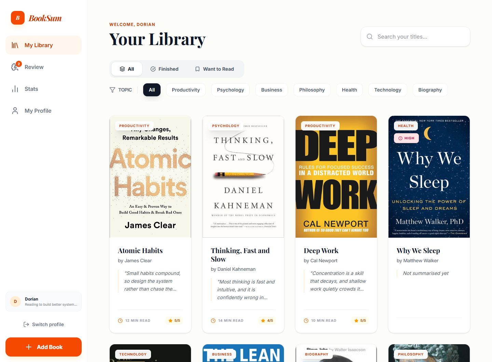
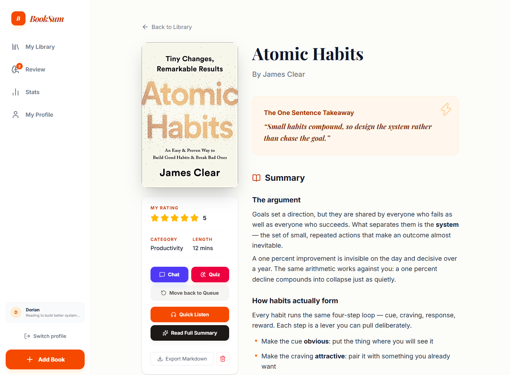
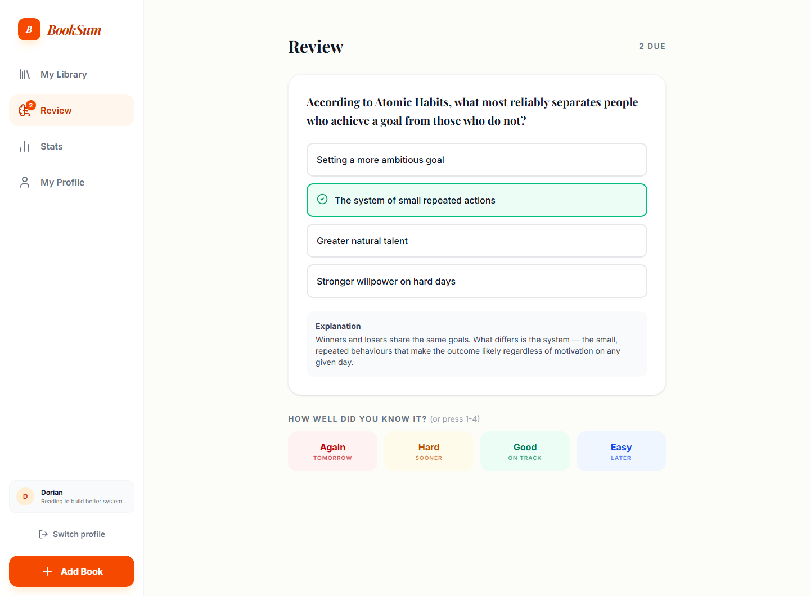
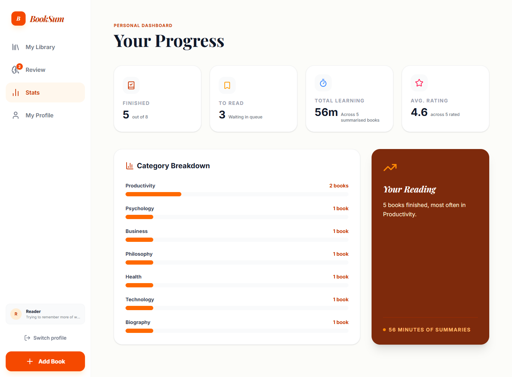
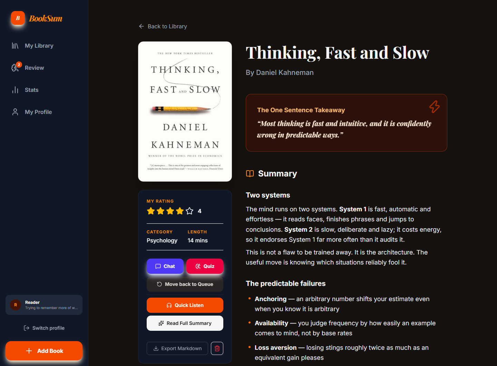
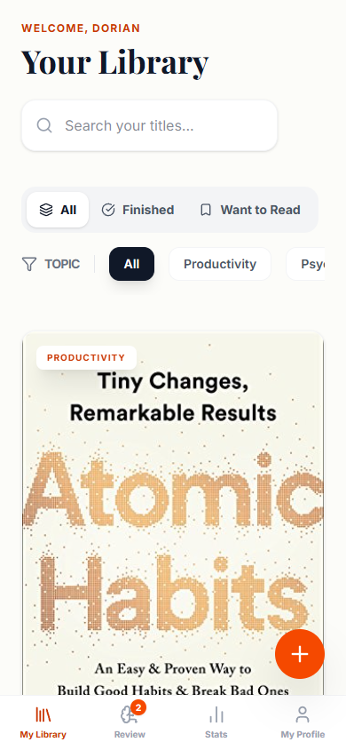

<div align="center">

# BookSum

**Turn any book into a summary, key insights, narrated audio and a quiz — then actually remember it.**

Everything is stored in your browser. No server, no account, no database of yours anywhere but your own machine.

[](https://github.com/dorianspitz23/booksum/actions/workflows/ci.yml)
[](LICENSE)
[](https://react.dev)
[](https://www.typescriptlang.org)
[](https://vite.dev)
[](#testing)

[Getting started](#getting-started) · [How your data is handled](#your-data-and-your-key) · [Contributing](CONTRIBUTING.md)

</div>

---

## Overview

BookSum is a reading companion that runs entirely in the browser. Add a book by title or upload a
PDF, and it produces a structured summary, a one-sentence takeaway, key insights and concrete next
actions. From there you can listen to it narrated, chat with it, test yourself, and let the
questions you got wrong come back on a spaced-repetition schedule.

It is **bring-your-own-key**: you supply a Google Gemini API key, it is kept in your browser, and it
is the only thing that ever leaves your machine — sent directly to Google, never to any server of
ours, because there isn't one.

<div align="center">
  
</div>

## Screenshots

<table>
<tr>
<td width="50%">

<p align="center"><em>Summary, takeaway, audio, chat and quiz</em></p>
</td>
<td width="50%">

<p align="center"><em>Spaced-repetition review, graded Again / Hard / Good / Easy</em></p>
</td>
</tr>
<tr>
<td width="50%">

<p align="center"><em>Progress, honestly counted</em></p>
</td>
<td width="50%">

<p align="center"><em>Dark mode, following your system by default</em></p>
</td>
</tr>
</table>

<div align="center">
  
  <p><em>Every destination reachable on a phone</em></p>
</div>

## Features

|                         |                                                                                                              |
| ----------------------- | ------------------------------------------------------------------------------------------------------------ |
| **AI summaries**        | By title, or from an uploaded PDF. Structured into a takeaway, a summary, key insights and actionable steps. |
| **Narrated audio**      | Five voices. Generated once and cached, so replaying costs nothing.                                          |
| **Chat with a book**    | Ask follow-up questions grounded in the summary.                                                             |
| **Quizzes**             | Multiple choice with explanations, validated before they are stored.                                         |
| **Spaced repetition**   | Quiz questions become cards on an SM-2-style schedule. Grade from the number row.                            |
| **Goodreads import**    | Drop in the official CSV export. Makes **zero** AI calls, so a 300-book library imports for free.            |
| **Reader**              | Full-screen reading view with its own light, sepia and dark themes, and remembered position.                 |
| **Markdown export**     | One book or the whole library, ready for Obsidian or Notion.                                                 |
| **Backup and restore**  | A JSON file carrying your books, summaries, settings and review schedule.                                    |
| **Local profiles**      | Several readers can share one browser and keep separate libraries.                                           |
| **Dark mode**           | Follows your system by default, with an explicit override.                                                   |
| **Works without a key** | Library, notes, reading, import/export, stats, review and profiles never ask for one.                        |

## Your data and your key

This is the part worth being precise about.

- **Your library never leaves your browser.** Books, summaries, notes, PDFs, audio and review cards
  live in IndexedDB on your machine. There is no account and no server to sync to.
- **Your API key is stored in `localStorage`** and sent only to Google's Gemini API. It is never
  bundled into the build, never committed, and never transmitted anywhere else. CI fails if a
  key-shaped string ever appears in a build.
- **Loading the app contacts nobody.** Fonts are bundled rather than fetched from a CDN, so opening
  BookSum makes no third-party request at all until you use a feature that needs one.
- **Network calls happen only when you act**: Gemini when you use an AI feature, and
  OpenLibrary or Google Books when you add a book and it looks for a cover.
- **Profiles are not security.** They have no passwords and exist so people sharing a browser can
  keep separate shelves. Anyone with access to the browser can open any profile.

### What it costs

You are billed by Google for what you use, on your own key. Google's free tier covers casual use at
the time of writing, but check [current pricing](https://ai.google.dev/pricing) yourself.

BookSum is built to not spend your money carelessly: importing a library is free, narrated audio is
cached rather than regenerated, and summaries are produced only for books you actually open.

## Getting started

### Prerequisites

- **Node.js 22.22.2+, 24.15+, or 26+.** The gaps are not arbitrary — `jsdom`, which the tests run
  on, disclaims the versions in between and `npm install` warns on them.
- A **Gemini API key** for the AI features. [Get one free](https://aistudio.google.com/apikey).
  You do not need it to try the rest of the app.

### Install and run

```bash
git clone https://github.com/dorianspitz23/booksum.git
cd booksum
npm install
npm run dev
```

Open the printed URL, create a profile, and paste your key when BookSum first asks for one — or
skip it and explore the library, reader and import first. You can add, view and remove the key at
any time from **My Profile**.

### Build for production

```bash
npm run build     # typechecks, then builds to dist/
npm run preview   # serves the built output
```

`dist/` is static files — host them anywhere, or open them from a local server. Serving from a
sub-path rather than a domain root needs that path baked in, or the assets and routes both break:

```bash
BASE_PATH=/booksum/ npm run build
```

There is no hosted demo. It is a client-side app that asks for your own API key, and a page that
collects keys is a thing worth hosting deliberately rather than by default.

## Tech stack

| Layer   | Choice                         | Why                                                     |
| ------- | ------------------------------ | ------------------------------------------------------- |
| UI      | React 19 + TypeScript 6        | Strict mode, with several extra compiler checks enabled |
| Build   | Vite 8                         | Fast dev server; production build in a few seconds      |
| Styling | Tailwind CSS 4                 | Class-based dark mode via a `.dark` class on `<html>`   |
| Routing | React Router 8                 | Client-side, with a catch-all route for stale links     |
| Storage | IndexedDB via `idb`            | Holds books, summaries, blobs and review cards          |
| AI      | `@google/genai` (Gemini)       | Summaries, audio, chat, quizzes, recommendations        |
| Icons   | `lucide-react`                 |                                                         |
| Testing | Vitest + Testing Library       | 446 tests across 37 files                               |
| Quality | ESLint (type-aware) + Prettier | Both run in CI and must pass                            |

## Architecture

```
src/lib/         React-free: storage (IndexedDB), ai, covers, audio, srs, markdown, goodreads
src/features/    Feature folders: library, book, profile, review, settings, stats
src/components/  Shared UI; components/ui holds Dialog, ConfirmDialog, Toast, useFocusTrap
src/app/         Shell, routes, error boundary
```

Two layering rules hold the shape together, and ESLint enforces the first:

- `src/lib/**` never imports React.
- `src/features/**` and `src/components/**` never import `idb` or `@google/genai` directly — they
  go through `src/lib/storage/repo.ts` and `src/lib/ai/*`.

A few decisions worth knowing before reading the code:

- **`Book` and `Summary` are separate records.** A book can exist unsummarised, which is exactly
  what makes Goodreads import free.
- **`readingTimeMinutes` and `oneSentenceTakeaway` are deliberately denormalised onto `Book`**, so
  list views render without loading every summary.
- **PDFs and audio are raw bytes in a separate `blobs` store**, never base64 on a record. Storing
  binary data inline is what broke the app this was rebuilt from.
- **Model IDs live in exactly one file**, `src/lib/ai/models.ts`.
- **Anything the model returns is validated before it is stored.** A quiz whose correct-answer index
  points outside its own options is rejected at the boundary rather than jamming your review deck.

`CLAUDE.md` documents the project's invariants and the gotchas found the hard way — worth a read
before a first contribution.

## Testing

```bash
npm test           # the whole suite, once
npm run test:watch # watch mode
npm run test:smoke # the fast "is it on fire" checks
```

Unit and integration tests only; there is no E2E suite. Tests live beside their subject
(`foo.ts` → `foo.test.ts`).

> **One thing to watch:** under memory pressure Vitest can fail to _start_ worker threads and report
> fewer test files than exist. It exits non-zero when that happens, but the summary line still reads
> as a pass at a glance. There are **37 test files** — if a run reports fewer, it did not test what
> you think it did.

## Scripts

| Command                | What it does                          |
| ---------------------- | ------------------------------------- |
| `npm run dev`          | Start the dev server                  |
| `npm run build`        | Typecheck, then build to `dist/`      |
| `npm run preview`      | Serve the production build            |
| `npm run typecheck`    | `tsc --noEmit`                        |
| `npm run lint`         | ESLint, type-aware                    |
| `npm run lint:fix`     | ESLint with `--fix`                   |
| `npm run format`       | Prettier, writing in place            |
| `npm run format:check` | Prettier in check mode — what CI runs |
| `npm test`             | Run the test suite once               |

CI runs typecheck, lint, format check, tests and build on every push and pull request.

## Contributing

Contributions are welcome. [CONTRIBUTING.md](CONTRIBUTING.md) covers the setup, the four checks
every commit has to keep green, and what a good pull request looks like here.

Found a security issue? Please read [SECURITY.md](SECURITY.md) first rather than opening a public
issue.

## Project history

BookSum began as a Google AI Studio export and was rebuilt in four phases: a storage and routing
foundation, a quality pass, features (dark mode, export, Goodreads import, spaced repetition), and
then a full defect sweep — 441 findings, worked through by severity, each closed finding named in
the commit that closed it. The findings and what was done about each are in
`audit-reports/_harvest/`, and the design notes and per-phase plans are in `docs/superpowers/`.

## License

[MIT](LICENSE) © 2026 drnblds
